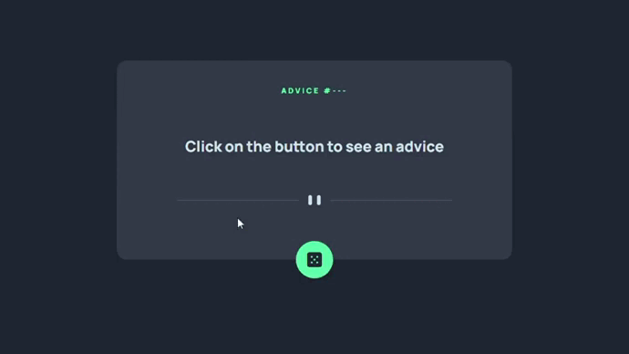

# Projeto | Advice Generator App

### Desenvolvido como projeto de estudo.

### Focos de estudo: Uso de api's

Confira o resultado [clicando aqui](https://jeanwisotscki.github.io/Advice-generator-app/) (Dica: control + click para abrir o link em uma nova guia. 😉)

# Preview do projeto

# Techs usadas no desenvolvimento

- HTML
- CSS
- JS
- GIT

# Desenvolvido por

- [@jeanwisotscki](https://github.com/jeanwisotscki/)
